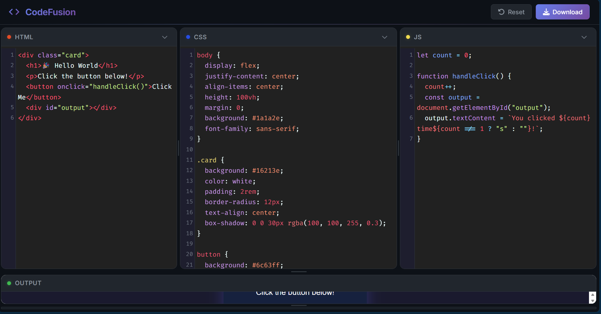
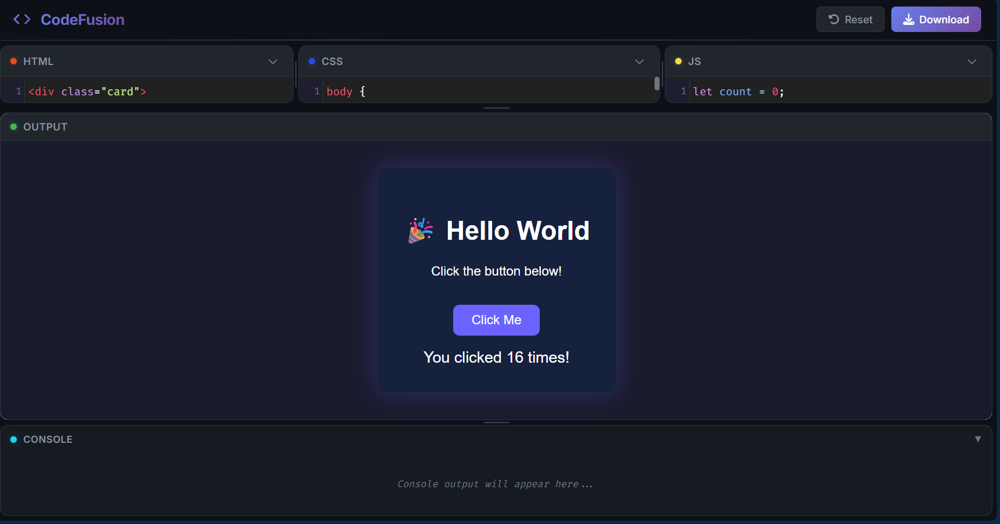
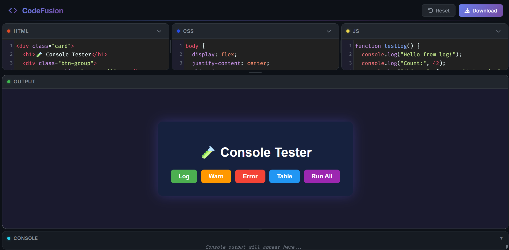
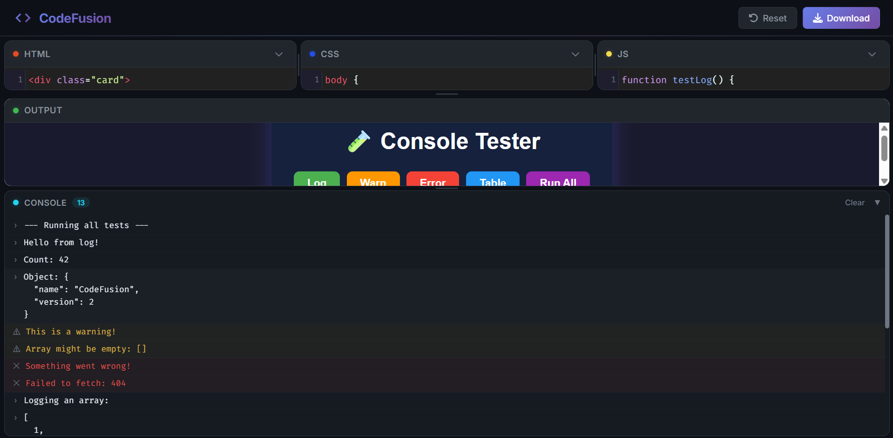

# CodeFusion

A sleek, browser-based live code editor — write HTML, CSS, and JavaScript and see the output update in real time.


## Screenshots





## Features

- **Live Preview** — Output updates automatically as you type (300ms debounce)
- **Three-Pane Editor** — Side-by-side HTML, CSS, and JavaScript editors with syntax highlighting
- **Resizable Panels** — Drag the sash dividers to resize editors, output, and console sections
- **Inline Console** — Captures `console.log`, `console.warn`, and `console.error` output directly in the UI
- **Code Persistence** — Your code is saved to `localStorage` and survives page refreshes
- **Download Export** — Export your creation as a standalone `.html` file
- **Reset** — One-click to clear all editors
- **Dark Theme** — Modern dark UI inspired by VS Code
- **Auto-Close** — Tags, brackets, and quotes close automatically

## Tech Stack

| Technology | Purpose |
|---|---|
| [React 18](https://reactjs.org/) | UI framework |
| [CodeMirror 5](https://codemirror.net/5/) | Code editor with syntax highlighting |
| [react-codemirror2](https://www.npmjs.com/package/react-codemirror2) | React wrapper for CodeMirror |
| [Font Awesome](https://fontawesome.com/) | Icons |

## Getting Started

```bash
# Install dependencies
npm install

# Start development server
npm start
```

Open [http://localhost:3000](http://localhost:3000) to use the editor.

## Project Structure

```
my-code-pen/
├── public/
│   └── index.html            # HTML shell
├── src/
│   ├── index.js              # React entry point
│   ├── index.css             # Global styles (dark theme)
│   ├── components/
│   │   ├── App.js            # Main app — state, live preview, download/reset
│   │   ├── Editor.js         # Reusable code editor component
│   │   ├── Header.js         # Top navigation with branding & actions
│   │   ├── ConsolePanel.js   # Inline console output panel
│   │   └── SplitPane.js      # Resizable split pane with draggable sash
│   └── hooks/
│       └── useLocalStorage.js # Custom hook for persistent state
└── package.json
```

## How It Works

1. You type code in the HTML, CSS, or JS editor
2. After 300ms of inactivity (debouncing), the app combines your code into a single HTML document
3. That document is injected into a sandboxed `<iframe>` via `srcDoc`
4. Console methods inside the iframe are overridden to send messages to the parent via `postMessage`
5. The `ConsolePanel` component displays those messages with color coding
6. All code is auto-saved to `localStorage` via a custom hook

## License

MIT
